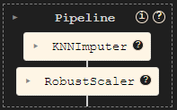
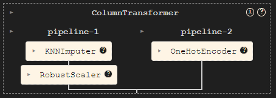

# 🛳️ Kaggle Titanic Challenge
## The challenge
Build a predictive model that answers the question : "what sorts of people were more likely to survive ?"

## The data

| Column name | Type | Description |
|-------------|------|-------------|
|PassengerId  |int   | Unique identifier for each passenger|
|Pclass       |int   | Ticket class|
|Sex          |int   | Passenger sex|
|Age|int|age in years|
|SibSp|int|# of siblings / spouses aboard the Titanic|
|Parch|int|# of parents / children aboard the Titanic|
|Ticket|object|Ticket number|
|Fare|float|Passenger fare|
|Cabin|object|Cabin number|
|Embarked|object|Port of embarkation|
|Survived|int|The target / Whether the passenger survived or not|

## Baseline

### Handling missing data
* The `Cabin` column contains more than 70% of missing data. This column was dropped.
* The `Age` column contains 20% missing data. I decided to impute the missing values with a `KNNImputer`

### Numerical columns
There are two numerical columns : `Age` and `Fare`

This is the `numerical pipeline`

### Categorical columns
Those are the categorical columns : `Plcass`, `Sex`, `SibSp`, `Parch` and `Embarked`

The `categorical pipeline` is only a `OneHotEncoder`

The `remainder` columns are dropped.

### Estimator
I used a simple `LogisticRegression` for the baseline.

On my `validation data` I have a **~82% accuracy**.

### Baseline submission

